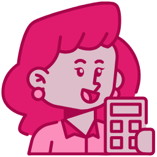

<p align="center">
  <a href="" rel="noopener">
 </a>
</p>

# PlanB: Control de Gastos

Aplicación web para el control de gastos personales que te permite llevar un registro de tus finanzas, establecer un presupuesto y visualizar en qué gastas tu dinero.

## 🚀 Demo

[Puedes ver una demostración en vivo aquí](URL_DE_LA_DEMO_EN_VIVO)

*(Si no tienes una demo, puedes eliminar esta sección)*

## 📸 Visuales

Aquí tienes un vistazo de cómo se ve la aplicación:


*(Puedes reemplazar `URL_DE_LA_IMAGEN_O_GIF` con una captura de pantalla o un GIF de tu aplicación. Tienes un video `bucle.mp4` en tu proyecto que podrías convertir a GIF)*

## 📝 Contenido

- [Acerca del Proyecto](#acerca-del-proyecto)
- [Funcionalidades](#funcionalidades)
- [Comenzando](#comenzando)
- [Construido con](#construido-con)
- [Autores](#autores)

## 🧐 Acerca del Proyecto <a name = "acerca-del-proyecto"></a>

Este proyecto es una herramienta de seguimiento de gastos diseñada para ayudar a los usuarios a administrar sus finanzas personales de manera efectiva. Los usuarios pueden definir un presupuesto mensual o semanal, registrar cada gasto y asignarlo a una categoría. La aplicación proporciona una representación visual del presupuesto, mostrando cuánto se ha gastado y cuánto queda disponible.

## ✨ Funcionalidades <a name = "funcionalidades"></a>

- **Gestión de Presupuesto:** Define un presupuesto inicial y reinícialo cuando lo necesites.
- **Registro de Gastos:** Añade nuevos gastos con nombre, cantidad y categoría.
- **Edición de Gastos:** Modifica los detalles de un gasto existente.
- **Eliminación de Gastos:** Borra gastos que ya no necesites.
- **Categorización:** Asigna tus gastos a categorías predefinidas como comida, casa, ocio, salud, etc.
- **Filtrado:** Filtra los gastos por categoría para analizar tus hábitos de consumo.
- **Visualización de Datos:** Un gráfico interactivo muestra el porcentaje del presupuesto gastado y el disponible.
- **Persistencia de Datos:** Los gastos y el presupuesto se guardan en el `localStorage` del navegador para que no pierdas tu información.

## 🏁 Comenzando <a name = "comenzando"></a>

Sigue estos pasos para tener una copia del proyecto corriendo en tu máquina local para desarrollo y pruebas.

### Prerrequisitos

Necesitarás tener Node.js y npm (o Yarn) instalados en tu sistema.

- [Node.js](https://nodejs.org/)
- [npm](https://www.npmjs.com/get-npm)

### Instalación

1. Clona el repositorio (si está en GitHub, reemplaza la URL):
   ```sh
   git clone https://github.com/tu-usuario/tu-repositorio.git
   ```
   *(Si no tienes un repositorio remoto, puedes omitir este paso si ya tienes los archivos.)*

2. Navega al directorio del proyecto:
   ```sh
   cd PlanB-Control-de-Gastos
   ```
3. Instala las dependencias:
   ```sh
   npm install
   ```
4. Inicia el servidor de desarrollo:
   ```sh
   npm run dev
   ```

Abre tu navegador y visita `http://localhost:5173` (o el puerto que indique Vite) para ver la aplicación en funcionamiento.

## ⛏️ Construido con <a name = "construido-con"></a>

- [Vue.js](https://vuejs.org/) - El framework web progresivo.
- [Vite](https://vitejs.dev/) - Herramienta de frontend de próxima generación.

## ✍️ Autores <a name = "autores"></a>

- [@DaCazo15](https://github.com/DaCazo15) - Desarrollo inicial
